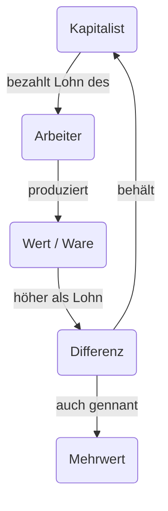

# Klassensystem im Kapitalismus

Date: {2026-06-18} | #status/done |

Karl Marx unterschiedet die Gesellschaft keineswegs, wie häufig geglaubt, zwischen Menschen mit viel oder wenig Geld auf ihrem Konto.

Eine ganz andere Frage ist von viel größerer Revelanz.

> Wer besitzt die Produktionsmittel?

> [!note]
Produktionsmittel sind all die Dinge, die benötigt werden, um Güter oder Dienstleistungen herzustellen - also Fabriken, Maschinen, Land, große Serverfarmen oder auch Rohstoffe.

Anhand dieser Frage ergeben sich drei Klassen.

### Die Kapitalisten (Die Bourgeoisie)

Dies ist die herrschende Klasse im Kapitalismus
Sie sind die **alleinigen** Eigentümer von **Produktionsmittel**.
Sie sind einzigartig, da Sie nicht selbst arbeiten müssen um zu überleben. 
Stattdessen kaufen sie Arbeitskraft von anderen Menschen ein.

Aber wenn Sie nicht arbeiten, woher kommt ihr Geld?
Dieses Konzept nennt Marx das Prinzip des Mehrwerts.

## Die Lohnarbeiter (Das Proletariat)

Die Lohnarbeiter sind die größte Mehrheit der Menschen, Sie besitzen **keine eigene Produktionsmittel**.
Um ihre Miete und ihr Essen bezahlen zu können, haben sie keine andere Wahl, als ihre eigene **Arbeitskraft** (ihre Zeit, Kraft, Gehirn) an die **Kapitalisten** zu verkaufen.
Sie sind diejenigen die den eigentlich Reichtum der Gesellschaft erschaffen, da sie die Maschinene bedienen, die Produkte bauen, etc., aber sie bekommen davon nur einen **Bruchteil** im Form von Lohn zurück.

## Das Kleinbürgertum (Die Petit Bourgeoisie)

Diese Menschen sind die "Zwischenschicht".
Sie sind zum Beispiel kleine Handwekrsmeister mit eigener Werkstatt, kleine Ladenbesizter, selbständige Bauern oder heute vielleicht Freelancer.

Sie besitzen zwar **Produktionsmittel**, ihre Werkstatt, ihren Laden, ihr Werkzeug, aber diese sind so **klein**, dass sie nicht (oder kaum) davon leben können, andere für sich arbeiten zu lassen.
Sie **müssen** selbst mitarbeiten.

Marx gint davon aus, dass Kleinbürger auf Dauer zerbrechen werden.
Wenn der Kapitalismus wächst, werden die großen Unternehmen (Kapitalisten) immer mächtiger und verdrängen die kleinen Läden.

Ein paar wenige Kleinbürger schaffen den Aufstieg zu echten Kapitalisten, aber die allermeisten rutschen ab und werden irgendwann selbst zu Lohnarbeiteren.

----

Diese Darstellung ist allerdings noch sehr simpel, es gibt verschiedene spezielle Zwischenformen.

## Der fungierende Kapitalist" (Dirigent des Kapitals)

Karl Marx hat im dritten Band seines Werks Das Kapital tatsächlich schon vorausgesehen, dass Unternehmen irgendwann so groß werden, dass die echten Eigentümer (die Aktionäre) nicht mehr selbst in der Fabrik stehen, um den Laden zu leiten. Sie heuern stattdessen Manager an.

Marx nannte diese Manager „fungierende Kapitalisten“ oder „Dirigenten des fremden Kapitals“.

Sie besitzen die Produktionsmittel zwar nicht privat (die gehören der Aktiengesellschaft), aber sie üben die absolute Kontrolle darüber aus.

Die „Arbeit“ eines CEOs besteht im Marxismus nicht darin, Werte zu schaffen, sondern den Ausbeutungsprozess zu organisieren und zu überwachen. Sie sorgen dafür, dass die Lohnarbeiter so effizient wie möglich Mehrwert für die Aktionäre herauspressen. Sie führen also die Funktion des Kapitals aus.

Man mag sich nun fragen, die Menschen bekommen doch ein Gehalt, also sind sie Lohnarbeiter, oder?

Ja, ein CEO bekommt ein Gehalt. Aber dieses Gehalt unterscheidet sich fundamental von dem eines normalen Angestellten:

Ein normaler Arbeiter bekommt einen Lohn, der meistens gerade so seinen Lebensstandard deckt. Ein CEO-Gehalt ist jedoch so gigantisch, dass es unmöglich als „Gegenwert für geleistete Arbeitsstunden“ gerechtfertigt werden kann.

Der Großteil der Vergütung eines CEOs besteht heute aus Boni, Aktienoptionen und Unternehmensanteilen. 
Wenn der CEO den Profit maximiert, steigt sein eigener Reichtum astronomisch. Wirtschaftlich gesehen wird der CEO also nicht aus dem Verkauf seiner eigenen Arbeitskraft bezahlt, sondern er wird am angehäuften Mehrwert (dem Profit) beteiligt. Er lebt vom selben Topf wie die Kapitalisten.

> [!note]
> Ein CEO arbeitet zwar, aber seine Arbeit ist die Verwaltung und Maximierung von Kapital, nicht die Produktion von Waren. Da er die volle Kontrolle über die Produktionsmittel hat und sein astronomisches Einkommen direkt aus dem Mehrwert der Arbeiter stammt, zählt er im Marxismus zur Kapitalistenklasse.

### Quellen:

**I. CEO als "fugierenden Kapitalisten"**
  i.  Karl Marx: Das Kapital. Kritik der politischen Ökonomie. Band III 
      (5. Abscnitt, Kapitel 23: "Zins und Unternehmergewinn"
      
**II. Drei Grundklassen**
  i. Karl Marx / Friedrich Engels: Manifest der Kommunistischen Partei (1848) 
  (Kapitel I: „Bourgeois und Proletarier“)